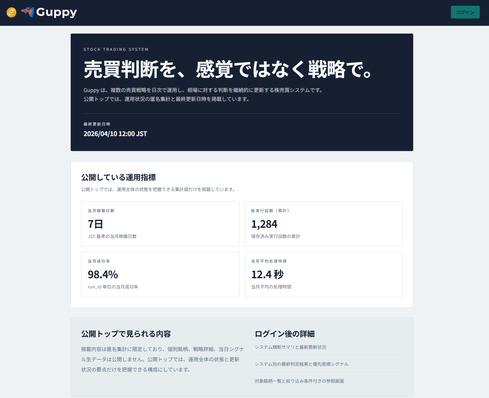
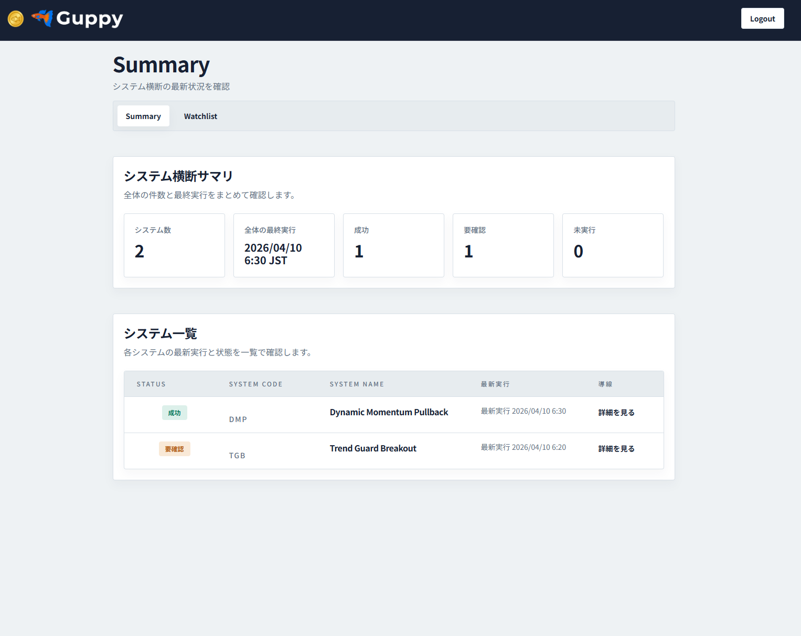
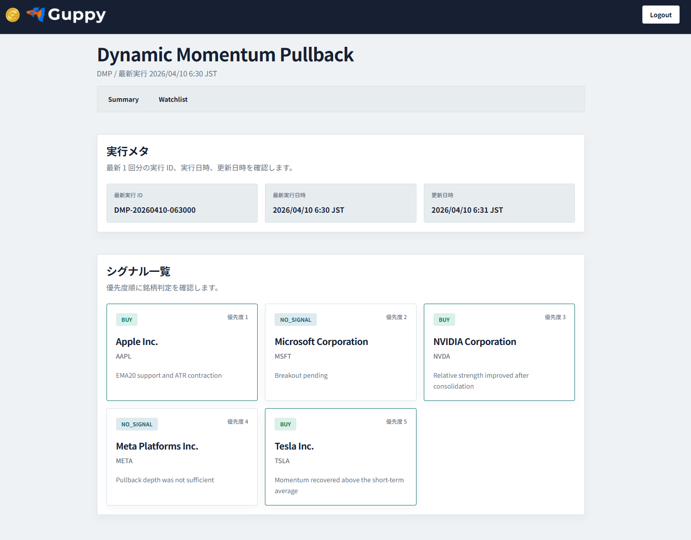
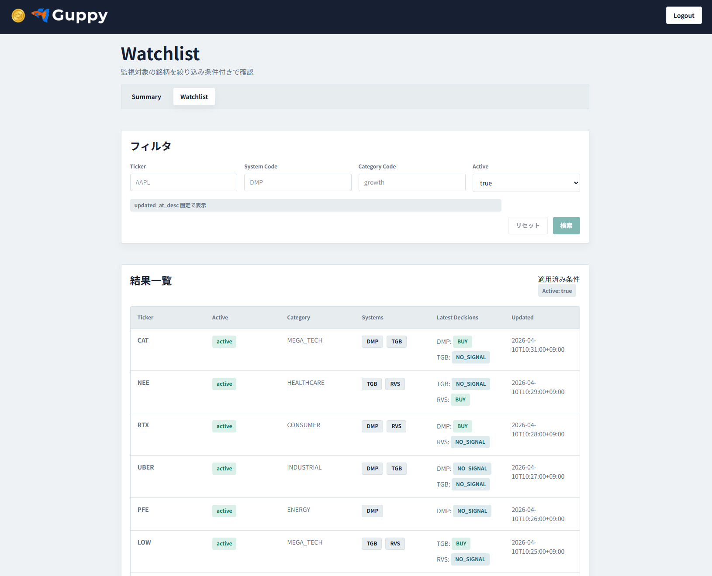

# Guppy Web System

## 概要
Guppy Web System は、自身の株式トレード支援を目的に開発している個人プロダクトです。

日次で生成される銘柄関連データ、ウォッチリスト、システム別の最新結果を一覧し、自身の確認作業を効率化するためのアプリです。
本リポジトリでは、公開可能な Web/API 実装、設計ドキュメント、AI支援開発ルールを管理しています。

## 3行サマリ

- 自身の株式トレード支援を目的に開発している、React / Python / AWS想定の個人プロダクトです。
- 売買ロジックや実データは非公開にし、公開リポジトリではWeb/API/設計ドキュメント/AI支援開発ルールを管理しています。
- 要件定義・基本設計・画面設計を作成したうえで、Codexを活用してSDD風に開発しています。

## 開発目的

このプロジェクトは、見せるためだけのポートフォリオではなく、自分自身の株式トレード支援に利用することを目的に開発しています。

あわせて、以下の学習・検証も目的としています。

- React / TypeScript を用いたモダンフロントエンド開発の理解
  - Skills を用いた学習支援の検証
- フロントエンド、バックエンド、バッチ処理の責務分離
- 要件定義書・基本設計書・画面設計書を作成してから実装するSDD風の開発プロセス
- Codexを活用したAI支援開発
- AGENTS.mdによる開発ルール・AI利用ルールの整備

## スクリーンショット

### 公開トップ



### 認証後サマリ



### システム詳細



### ウォッチリスト



## ポートフォリオとして見てほしい点

- React / TypeScript による画面分割、ルーティング、APIクライアント設計
- TanStack Query を使った非同期データ取得と画面状態管理
- Python による参照APIの handler / usecase / repository 分離
- ダミーAPIを用いた公開リポジトリ単体での画面確認
- API Gateway + Lambda + DynamoDB を想定した責務分離
- 要件定義・基本設計・画面設計を先に整理する開発プロセス
- 売買ロジックや実データを公開しないセキュリティ設計
- 単体テストと主要ルートのE2Eテスト

## 設計判断・トレードオフ

- 実データや売買ロジックは公開せず、Web/API/設計ドキュメントのみ公開する方針にしました。
- 実DBがなくても画面確認できるよう、固定ダミーデータを返す簡易サーバーを用意しました。
- Web/API の本番デプロイは手動構築で完了済みです。ただし、バッチ処理側の本番対応は未対応のため、Web/API の公開構成を先行して検証しています。
- デプロイ構成は当初想定していた `CloudFront + S3 + API Gateway + Lambda + DynamoDB + Cognito` を基本とし、設計方針どおりの責務分離で構成しています。
- IaC は TypeScript 版 AWS CDK で初期実装し、手動構築済み環境とは別の検証環境で `synth` / `bootstrap` / `deploy` / `destroy` の流れを確認済みです。
- CI/CD は GitHub Actions で段階的に整備しており、フロントエンドの本番向け手動CDは動作確認済みです。
- 公開範囲ではドメインロジックが限定的なため、DDDの全面適用ではなく、handler / usecase / repository の責務分離を優先しました。

## 技術スタック

### Frontend

- React
- TypeScript
- Vite
- React Router
- TanStack Query
- Tailwind CSS

### Backend

- Python
- AWS Lambda想定
- API Gateway想定
- DynamoDB想定

### Development

- Docker / Docker Compose
- devcontainer
- AGENTS.md
- Codex

### Infrastructure

- AWS CDK v2
- TypeScript
- CloudFormation
- SSM Parameter Store

## 現在の進捗

現時点では、Web/API の本番デプロイは手動構築で完了しています。
デプロイ構成は、当初想定していた AWS 構成どおりに構築しています。
一方で、日次データ更新やシグナル生成を担うバッチ処理側の本番対応は未対応です。
そのためバッチ実行結果はダミーの値をDBに登録し表示させています。

また、既存の手動構築・運用手順を整理しながら、IaC への移行を実践中です。
現在は `infra/cdk` に TypeScript 版 AWS CDK の初期構成を追加し、手動構築済み環境を直接取り込むのではなく、別環境を作成して検証する方針にしています。
CI/CD は GitHub Actions で整備中で、フロントエンドは `frontend-prd` Environment と GitHub OIDC を使った手動デプロイを確認済みです。

フロントエンドはローカル環境で起動でき、主要画面・主要機能を確認できる状態です。
バックエンドも実装していますが、実データ参照には非公開リポジトリ側で管理しているDB定義・バッチ処理・実データが必要です。

そのため、本リポジトリ単体では実DBを用いたバックエンドAPIの完全な動作確認はできません。
フロントエンド確認用として、ダミーデータを返す簡易サーバーを用意しています。

### 対応済み

- React / TypeScript / Vite によるフロントエンド
  - 公開トップ画面
  - ログイン後のサマリ画面
  - システム別詳細画面
  - ウォッチリスト画面
  - APIクライアント
- バックエンドAPI
- Web/API の本番デプロイ
- GitHub Actions による CI
  - フロントエンド lint / typecheck / unit test / E2E / build
  - バックエンド ruff / mypy / pytest
  - CDK build / synth
- GitHub Actions によるフロントエンド手動CD
  - GitHub OIDC による AWS 認証
  - S3 sync
  - CloudFront invalidation
- TypeScript 版 AWS CDK によるインフラ定義の初期実装
  - S3 / CloudFront
  - Cognito User Pools
  - API Gateway / Lambda
  - DynamoDB
  - CloudWatch
  - GitHub Actions OIDC 用 IAM Role
- フロントエンド確認用のダミーサーバー
- ドキュメント
  - 要件定義書
  - 基本設計書
  - 画面設計書
- AI支援開発環境
  - AGENTS.md による開発ルール、品質基準、AI利用方針の明文化
  - MCP / Skills を用いたコード調査、実装支援、レビュー支援の整備
  - Kiro / CC-SDD を参考にした要件定義、設計、タスク分解、実装のワークフロー化
  - React 学習用 Skills を用いたコンポーネント実装・レビューの学習プロセス検証
  - devcontainer による再現性のある開発環境とAI支援ツール利用環境の整備
- レスポンシブ対応
- 単体テスト
- 基本ルートのE2Eテスト

### 対応中

- バックエンドCD構築
- IaC の本番移行方針整理
- バッチ処理側の本番対応
- 手動構築済みリソースからCDK管理環境への移行検討
- CC-SDD風ワークフローを用いた開発プロセスの改善

## ローカル動作について

本リポジトリでは、用途に応じて2種類のローカルサーバーを使い分けます。

フロントエンド単体の表示確認と、Lambda ハンドラー経由の DynamoDB 接続確認を分けることで、非公開データに依存しない画面開発と、本番構成に近い API 検証を切り分けています。

### 1. フロントエンド確認用ダミーサーバー

フロントエンドの画面確認を目的とした簡易サーバーです。

固定のダミーデータを返すため、非公開リポジトリ側の DynamoDB 定義、実データ、バッチ処理がなくても、主要画面の表示や操作感を確認できます。

### 2. DynamoDB接続確認用ローカルAPIサーバー

Lambda 用のハンドラーコードをローカル HTTP サーバーから呼び出し、DynamoDB Local に接続して実データ形式のレスポンスを返す確認用サーバーです。

本番想定の `API Gateway + Lambda + DynamoDB` 構成に近い形で、handler / usecase / repository の流れをローカルで確認するために用意しています。

ただし、実データ参照には非公開リポジトリ側で管理している DynamoDB テーブル定義、初期データ、バッチ処理が必要です。

## 主な機能

- 公開トップ画面
  - サービス概要
  - 匿名集計サマリ
  - 最終更新日時の表示

- ログイン後画面
  - システム横断サマリ
  - システム別の最新実行結果
  - ウォッチリスト表示

- バックエンドAPI
  - 公開サマリ取得
  - 認証後サマリ取得
  - システム別最新結果取得
  - ウォッチリスト取得

- フロントエンド確認用ダミーサーバー
  - 固定のダミーデータを返却
  - 実DBや非公開リポジトリなしで主要画面の表示確認が可能

- DynamoDB接続確認用ローカルAPIサーバー
  - Lambda 用ハンドラーコードをローカル HTTP サーバーから呼び出し
  - handler / usecase / repository を通して DynamoDB Local からデータを取得
  - 本番想定の API Gateway + Lambda + DynamoDB 構成に近い流れをローカルで確認

## 公開範囲と非公開範囲

本リポジトリでは、Web フロントエンド、参照 API、設計ドキュメント、開発ルールを公開しています。

一方で、以下は非公開リポジトリで管理しています。

- 売買ロジック
- シグナル生成処理
- 実データを生成・更新するバッチ処理
- DynamoDB の詳細なテーブル定義
- 機密情報を含む設定
- 実運用データ

これは、ロジックや機密情報を公開しないための切り分けです。

公開リポジトリでは、Web/API の責務分離、画面構成、AI支援開発の進め方、設計ドキュメントを確認できるようにしています。

## 注意事項

本プロジェクトは、個人の学習および自身のトレード支援を目的としたものであり、第三者への投資助言や金融商品の売買推奨を目的としたものではありません。

公開リポジトリには、売買判断ロジック、実運用データ、認証情報、APIキー、機密設定は含めていません。

## アーキテクチャ方針

本システムは、以下の責務分離を前提にしています。

- フロントエンド
  - React / TypeScript による画面表示
  - API 経由でデータを参照

- バックエンドAPI
  - 画面向けの参照 API を提供
  - DynamoDB から必要なデータを取得し、画面表示向けに整形

- バッチ処理
  - 日次データ更新
  - シグナル生成
  - 集計データ生成
  - 非公開リポジトリで管理

- データストア
  - DynamoDB を想定
  - 詳細なテーブル定義は非公開リポジトリで管理

現在の Web/API のデプロイ構成は、以下の AWS 構成を基本としています。
バッチ処理側は未対応のため、EventBridge Scheduler + Lambda 構成は今後の対応対象です。

- Frontend: S3 + CloudFront
- API: API Gateway + Lambda
- Auth: Cognito User Pools
- Database: DynamoDB
- Batch: EventBridge Scheduler + Lambda

## デプロイ・IaC

初期の本番環境は AWS Console を使って手動構築しています。
現在は、同じ構成を再現可能にするために TypeScript 版 AWS CDK を `infra/cdk` に追加しています。
CI/CD は GitHub Actions で段階的に整備しており、フロントエンドは `frontend-prd` Environment の承認付き手動デプロイで S3 同期と CloudFront キャッシュ無効化まで確認済みです。

CDK で定義している主なリソースは以下です。

- `FrontendHostingStack`: S3 + CloudFront + OAC
- `DataStack`: DynamoDB
- `AuthStack`: Cognito User Pools / App Client
- `ApiStack`: API Gateway HTTP API + Lambda + IAM Role
- `MonitoringStack`: CloudWatch Logs / Alarms
- `GithubOidcStack`: GitHub Actions OIDC 用 IAM Role / Policy

基本コマンドは以下です。

```bash
cd infra/cdk
npm install
npm run build
npm run synth -- -c config=config/dev.example.json
```

実際のAWSアカウントへデプロイする場合は、`config/*.local.json` に環境固有値を置きます。
`*.local.json`、`cdk.out`、`node_modules`、Lambda zip、手動デプロイ値のローカルメモは Git 管理しません。

詳細は以下を参照してください。

- [インフラ IaC 設計](docs/design/infrastructure_iac_design.md)
- [IaC 移行計画](docs/operations/iac_migration_plan.md)
- [CI/CD・リリースフロー設計](docs/operations/ci_cd_design.md)
- [CDK README](infra/cdk/README.md)

## AI活用について

本プロジェクトでは、Codex を以下の用途で活用しています。

- 要件定義書・設計書のたたき台作成
- 実装方針の整理
- React / TypeScript / Python の実装補助
- コードの説明
- バグ調査・修正方針の相談
- README や AGENTS.md などの開発ドキュメント整備
- Skills を使った React のメンター

ただし、AIに実装を丸投げするのではなく、以下は自分で確認・判断するようにしています。

- 機能スコープ
- 公開範囲と非公開範囲の切り分け
- フロントエンドとバックエンドの責務分離
- 主要画面の構成
- API 連携の流れ
- 状態管理の方針
- セキュリティ上公開しない情報

## ドキュメント

本プロジェクトでは、SDD風に要件定義・設計ドキュメントを作成してから実装しています。

- 要件定義: [docs/required/web_system_required.md](docs/required/web_system_required.md)
- システム基本設計: [docs/design/system_basic_design.md](docs/design/system_basic_design.md)
- フロントエンド基本設計: [docs/design/frontend_basic_design.md](docs/design/frontend_basic_design.md)
- バックエンド基本設計: [docs/design/backend_basic_design.md](docs/design/backend_basic_design.md)
- API契約: [docs/design/frontend_api_contract.md](docs/design/frontend_api_contract.md)
- 全体ガイド: [AGENTS.md](AGENTS.md)
- バックエンドガイド: [apps/backend/AGENTS.md](apps/backend/AGENTS.md)

## 実ファイル構成

現時点で主要な管理対象は次のとおりです。

```text
.
├─ AGENTS.md                    # リポジトリ全体の開発ルール・AI利用ルール
├─ README.md                    # プロジェクト概要、起動方法、設計方針
├─ compose.yml                  # devcontainer / ローカルサーバー用 Docker Compose 定義
├─ .agents/
│  └─ skills/                   # Codex で利用するリポジトリ固有 Skills
├─ .devcontainer/
│  ├─ Dockerfile.dev            # 開発コンテナ用 Dockerfile
│  └─ devcontainer.json         # VS Code devcontainer 設定
├─ .githooks/
│  └─ pre-commit                # 機密情報を含む env ファイルの誤コミット防止
├─ .kiro/                       # CC-SDD設定ファイル
│  └─ steering/
│     ├─ product.md
│     ├─ structure.md
│     └─ tech.md
├─ apps/
│  ├─ backend/                  # 画面向け参照 API とローカル確認用サーバー
│  │  ├─ AGENTS.md              # バックエンド領域の開発ルール
│  │  ├─ Dockerfile.dev         # バックエンド開発用コンテナ定義
│  │  ├─ README.md              # バックエンドの詳細説明
│  │  ├─ scripts/               # ローカルサーバー起動スクリプト
│  │  │  ├─ run_dev.sh          # DynamoDB 接続確認用 API サーバー起動
│  │  │  └─ run_local_dev.sh    # フロントエンド確認用ダミーサーバー起動
│  │  ├─ src/
│  │  │  ├─ assemblers/         # ドメインモデルから API レスポンスへの変換
│  │  │  ├─ domain/             # サマリ、システム結果、ウォッチリストなどのドメイン定義
│  │  │  ├─ handlers/           # Lambda 想定の API ハンドラー
│  │  │  ├─ lib/                # レスポンス生成、設定、エラーなどの共通処理
│  │  │  ├─ parsers/            # パスパラメータやクエリ文字列の解析
│  │  │  ├─ repositories/       # DynamoDB 参照処理
│  │  │  ├─ usecases/           # 画面向けユースケース
│  │  │  ├─ local_dev_server.py # 固定ダミーデータを返す簡易サーバー
│  │  │  └─ main.py             # Lambda ハンドラーを呼び出すローカル API サーバー
│  │  ├─ tests/                 # バックエンドテスト
│  │  │  ├─ unit/
│  │  │  ├─ conftest.py
│  │  │  └─ test_local_dev_server.py
│  │  └─ requirements.txt       # Python 依存関係
│  └─ frontend/                 # React / TypeScript フロントエンド
│     ├─ AGENTS.md              # フロントエンド領域の開発ルール
│     ├─ DESIGN.md              # フロントエンド設計メモ
│     ├─ README.md              # フロントエンドの詳細説明
│     ├─ package.json           # npm スクリプト・依存関係
│     ├─ package-lock.json      # npm 依存関係ロック
│     ├─ vite.config.ts         # Vite 設定
│     ├─ playwright.config.ts   # Playwright E2E テスト設定
│     ├─ eslint.config.js       # ESLint 設定
│     ├─ prettier.config.mjs    # Prettier 設定
│     ├─ index.html             # Vite エントリ HTML
│     ├─ public/                # 静的アセット
│     │  ├─ favicon.ico
│     │  └─ guppy_logo.png
│     ├─ src/
│     │  ├─ app/                # アプリ初期化、ルーティング、レイアウト、プロバイダー
│     │  ├─ components/         # 共通 UI コンポーネント
│     │  ├─ features/           # 機能単位の API、hooks、components
│     │  ├─ lib/                # API クライアント、env 検証、ユーティリティ
│     │  ├─ pages/              # 画面単位のコンポーネント
│     │  ├─ styles/             # グローバルスタイル
│     │  └─ tests/              # Unit / Component / E2E テスト
│     └─ tsconfig*.json         # TypeScript 設定
├─ docs/
│  ├─ assets/
│  │  └─ screenshot/            # README 掲載用スクリーンショット
│  ├─ design/                   # 基本設計、API 契約、実装メモ
│  ├─ operations/               # CI/CD など運用設計
│  ├─ required/                 # 要件定義
│  └─ temp/                     # 学習メモなど一時ドキュメント
└─ plugins/
   └─ caveman/                  # ローカル検証用の Codex plugin
```

## ローカル開発

開発環境は devcontainer 前提です。ルート README では最短の起動手順のみ記載し、詳細な環境変数、DynamoDB Local 接続、テスト手順は各アプリの README を参照してください。

### Git フック

`.env` 系ファイルの誤コミットを防ぐため、devcontainer 作成時に `.devcontainer/devcontainer.json` の `postCreateCommand` で Git フックを自動設定します。

手動実行の場合は、次を実行してください。

```bash
git config --local core.hooksPath .githooks
```

### フロントエンド実行

```bash
cd apps/frontend
cp .env.example .env.local
npm install
npm run dev
```

既定ポートは `http://localhost:5173` です。

### フロントエンド + バックエンド実行

Docker Compose でフロントエンドとバックエンドを一緒に起動する場合は次を使います。

```bash
docker compose up -d backend_dev frontend_dev
docker compose logs -f frontend_dev
```

詳細は [apps/frontend/README.md](apps/frontend/README.md) と [apps/backend/README.md](apps/backend/README.md) を参照してください。

## テスト実行
現時点で、フロントエンド・バックエンドの主要テストはすべて通る状態です。

### フロントエンド

```bash
cd apps/frontend
npm run test
npm run test:e2e
```

### バックエンド

```bash
pytest apps/backend/tests
```
