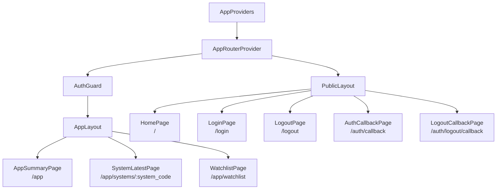
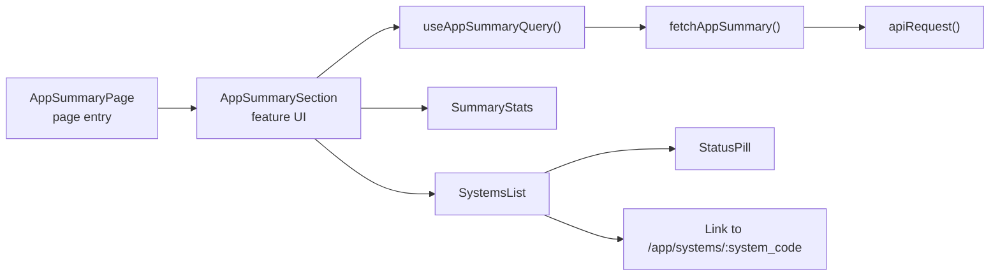
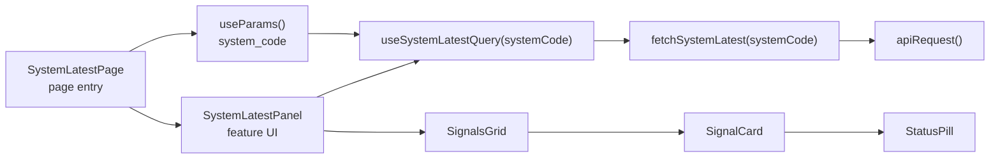
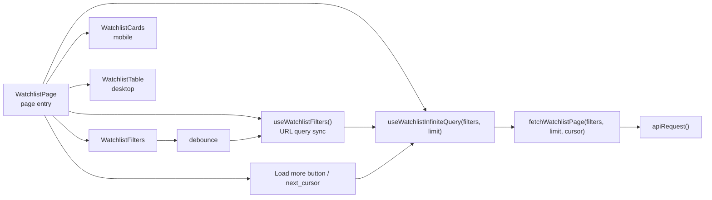

# Guppy フロントエンド基本設計

## 1. 文書目的
本書は、Guppy Webシステムにおけるフロントエンドの基本設計を定義する。  
対象は、公開トップページ、ログイン導線、認証後画面、OIDC 認証連携、API 呼び出し、レスポンシブ UI、フロントエンドの技術スタック選定である。

本書は、要件定義とシステム基本設計を受けて、フロントエンドの責務、構成、実装方針、採用技術を明確化することを目的とする。

## 2. 関連ドキュメント
- [Webシステム要件定義](/workspace/docs/required/web_system_required.md)
- [システム基本設計](/workspace/docs/design/system_basic_design.md)
- [フロントエンドビジュアル設計](/workspace/docs/design/frontend_visual_design.md)
- [フロントエンド実装メモ](/workspace/docs/design/frontend_implementation_memo.md)
- [バックエンド基本設計](/workspace/docs/design/backend_basic_design.md)
- [CI/CD・リリースフロー設計](/workspace/docs/operations/ci_cd_design.md)

## 3. スコープ

### 3.1 対象
- 公開トップページの画面設計
- ログイン導線と OIDC 認証連携
- 認証後画面のルーティングと表示責務
- API 呼び出し方式と認証トークン付与方針
- フロントエンドの技術スタック選定
- レスポンシブ、アクセシビリティ、テストの基本方針
- S3 + CloudFront 前提のビルド・デプロイ方針

### 3.2 対象外
- バックエンド API の詳細実装
- DynamoDB の属性設計
- バッチ処理の詳細実装
- 売買ロジックそのもの
- ネイティブモバイルアプリ実装

## 4. 前提
- フロントエンドは `S3 + CloudFront` で静的配信する。
- バックエンドとは分離デプロイ可能とする。
- 認証方式は `OIDC`、フロントエンドの認証フローは `Authorization Code Flow + PKCE` を採用する。
- 認証基盤は `Cognito User Pools` を第一候補とするが、`Auth0` 等の同等 OIDC プロバイダへ置換可能な構成とする。
- 公開トップページはポートフォリオページを兼ねるが、技術詳細はトップページ本文に載せない。
- 認証後画面は初期段階では参照専用とし、画面からのバッチ起動機能は初期スコープ外とする。
- 日付境界・時刻表示・集計意味は JST 基準とする。

### 4.1 サポート環境
- 対応ブラウザは主要モダンブラウザを対象とし、デスクトップでは `Chrome` `Edge` `Firefox` の最新版と 1 つ前のメジャーバージョンをサポート対象とする。
- モバイルでは `Android Chrome` の最新版を主対象とする。
- `Internet Explorer` および旧 `Edge Legacy` は対象外とする。
- 画面検証は少なくとも以下の代表幅で行う。
  - `375px` 前後: スマートフォン縦持ち
  - `768px` 前後: タブレット
  - `1280px` 以上: デスクトップ
- 対象外ブラウザでは完全な表示保証を行わず、機能劣化が生じうる。

## 5. フロントエンドアーキテクチャ概要

### 5.1 アーキテクチャ分類
本フロントエンドは以下の性質を持つ。

- 配信方式: `Static Hosting`
- 実行形態: `Single Page Application`
- UI 構造: `Component-Based Architecture`
- コード構成: `Feature-Oriented Structure`

### 5.2 採用理由
- 配信先が `S3 + CloudFront` であり、静的成果物と相性がよい
- 公開領域と認証後領域を 1 つのフロントエンドで自然に分離できる
- 画面数と API 数が少なく、まずは小さな SPA として始めるのが適切である
- ポートフォリオとしても、React ベースのコンポーネント設計、型安全性、認証連携、テストまで示しやすい
- SSR や BFF を導入しなくても、今回の要件は十分に満たせる

### 5.3 論理構成
```text
Browser
  -> CloudFront
      -> S3 (static frontend assets)

Frontend SPA
  -> OIDC Provider
      -> Access Token
          -> API Gateway
              -> Lambda

Frontend SPA
  -> Public API / Private API
      -> Render UI
```

## 6. 技術スタック設計

### 6.1 採用スタック
| レイヤ | 採用技術 | 主用途 | 採用理由 |
|---|---|---|---|
| 言語 | `TypeScript` | 型安全な実装 | API 連携、ルーティング、認証設定の誤りを早期に検出しやすい |
| UI | `React` | 画面実装 | ポートフォリオ価値が高く、コンポーネント指向で拡張しやすい |
| ビルド | `Vite` | 開発サーバ、ビルド | 構成が軽く、React 未経験でも始めやすく、静的配信と相性がよい |
| ルーティング | `React Router` | 公開/認証後ルート分離、保護ルート | 学習コストが比較的低く、SPA の標準的構成として説明しやすい |
| サーバ状態管理 | `TanStack Query` | API 取得、キャッシュ、再試行、ローディング管理 | 認証後画面の参照 API と相性がよく、UI 状態と分離できる |
| 認証 | `oidc-client-ts` + `react-oidc-context` | OIDC 認証、PKCE、トークン管理 | Cognito 固有 SDK に依存せず、OIDC 準拠でプロバイダ置換性を確保できる |
| 入力/レスポンス検証 | `Zod` | API レスポンス、環境変数の検証 | 想定外データの早期検知に向く |
| スタイリング | `Tailwind CSS` + CSS Variables | レスポンシブ UI、デザイントークン管理 | 画面密度の調整がしやすく、ポートフォリオ向けに独自性を出しやすい |
| テスト | `Vitest` + `React Testing Library` + `Playwright` | 単体/コンポーネント/E2E テスト | 振る舞いベースで確認しやすく、CI に載せやすい |
| 品質 | `ESLint` + `Prettier` | 静的解析、整形 | 初学者にも分かりやすく、一般的な構成で運用しやすい |

### 6.2 技術選定方針

#### `React + TypeScript`
- ポートフォリオとしての説明力と市場価値を優先する
- 画面数は少ないが、認証、ルーティング、API 連携、状態分離を学ぶ題材としてちょうどよい
- TypeScript を使うことで、`system_code` や API レスポンス shape の破壊的変更を検出しやすい

#### `Vite`
- `S3 + CloudFront` 向けの静的成果物を単純に出力できる
- 開発開始までの構成が軽く、React 未経験でも学習負荷を抑えやすい
- Node サーバ常駐を前提としないため、今回のコスト要件にも合う

#### `React Router`
- ルート数が少なく、`/` `/login` `/app` `/app/systems/:system_code` `/app/watchlist` 程度なら十分シンプルに扱える
- `ProtectedRoute`、ネストレイアウト、URL パラメータ、検索条件の URL 同期を実装しやすい
- `HashRouter` ではなく `BrowserRouter` を使い、CloudFront 側で SPA フォールバックを設定してクリーンな URL を維持する

#### `TanStack Query`
- 今回の API はすべて参照専用であり、サーバ状態管理ライブラリとの相性がよい
- ローディング、エラー、再試行、キャッシュを各画面で統一しやすい
- ローカル UI 状態とサーバ取得データを分離できる

#### `oidc-client-ts` + `react-oidc-context`
- OIDC 準拠の実装に寄せることで、Cognito 固有機能への依存を減らす
- `Authorization Code Flow + PKCE` に対応し、SPA で必要なリダイレクトフローを扱える
- 認証状態を React から自然に扱える

#### `Tailwind CSS`
- スマートフォン優先のレイアウト調整を高速に行いやすい
- カード、一覧、詳細画面で余白・密度・タイポグラフィを調整しやすい
- 大規模コンポーネントライブラリに依存せず、ポートフォリオとして独自の画面表現を作りやすい

### 6.3 採用しない候補

#### `Next.js`
- SSR、Server Components、フルスタック機能の学習コストが上がる
- 今回はバックエンドを API として分離する前提であり、Next.js の強みを使い切りにくい
- `S3 + CloudFront` の静的配信中心構成に対しては、Vite より設計上の説明コストが高い

#### `Astro`
- 公開トップだけを見ると相性はよいが、認証後画面は結局 React 的な状態管理が必要になる
- ポートフォリオと業務アプリの 2 つの設計思想が混在しやすく、初学習の軸がぶれやすい

#### `AWS Amplify Auth`
- Cognito との親和性は高いが、認証基盤の置換性を弱めやすい
- 今回は OIDC 準拠を優先し、プロバイダ依存をできるだけ薄くする

#### 大規模 UI コンポーネントライブラリ
- `MUI` や `Ant Design` は開発速度は上がるが、画面が既製品に寄りやすい
- 今回はポートフォリオ性を重視し、独自のビジュアル設計を優先する

## 7. 画面・ルーティング設計

### 7.1 ルート一覧
区分の意味は以下のとおりとする。

- `公開`
  - 未認証でもアクセス可能な利用者向け画面
- `認証必須`
  - 認証済み利用者のみを対象とする利用者向け画面
- `内部`
  - 認証やログアウトのリダイレクト処理に使うシステム内部ルート
  - 利用者がメニューや主要導線から直接利用する画面ではない

| ルート | 区分 | 主責務 | 利用 API |
|---|---|---|---|
| `/` | 公開 | サービス概要、匿名集計、最終更新日時、ログイン導線の表示 | `GET /api/v1/public/summary` |
| `/login` | 公開 | OIDC ログイン開始 | なし |
| `/auth/callback` | 内部 | OIDC コールバック受信、トークン確立、`/app` への遷移 | なし |
| `/app` | 認証必須 | システム横断サマリ表示 | `GET /api/v1/summary` |
| `/app/systems/:system_code` | 認証必須 | システム別最新実行結果表示 | `GET /api/v1/systems/{system_code}/latest` |
| `/app/watchlist` | 認証必須 | 対象銘柄一覧、検索・絞り込み | `GET /api/v1/watchlist` |
| `/logout` | 公開 | ログアウト開始 | なし |
| `/auth/logout/callback` | 内部 | ログアウト後遷移の完了、公開トップへの復帰 | なし |

### 7.2 レイアウト設計
- `PublicLayout`
  - 公開トップ、ログイン導線、ログアウト導線を保持する
  - ヘッダは全ページ共通の `GlobalHeader` を使い、公開トップでは `ログイン`、遷移ページでは戻り導線を置く
- `AppLayout`
  - ログイン後の共通ヘッダ、ナビゲーション、ログアウト導線を保持する
  - `/app` `/app/systems/:system_code` `/app/watchlist` を共通レイアウト配下に置く
  - `PublicLayout` と同じ `GlobalHeader` を使い、右側アクションだけを `Summary` `Watchlist` `Logout` に切り替える
  - システム詳細の現在地はページヘッダで補う
- `AuthGuard`
  - 未認証時は `/login` へ誘導する
  - ただし実際のアクセス制御は API Gateway JWT Authorizer が担い、フロントエンドのガードは UX 向上のための導線制御とする

### 7.3 画面ごとの責務

#### `/`
- ポートフォリオページとしての第一印象を担う
- 表示内容は以下に限定する
  - サービス概要
  - 匿名集計カード
  - 最終更新日時
  - ログイン導線
- 匿名集計カードは要件で定義された固定見出しを使い、個別銘柄や戦略詳細は表示しない

#### `/login`
- 画面表示後に OIDC ログインへリダイレクトする
- リダイレクト前の説明文と、失敗時の再試行ボタンを置く

#### `/logout`
- ログアウト開始前の遷移ページとして扱う
- ログイン不要で開けるが、機密情報は表示しない
- ログアウト継続導線と公開トップへの戻り導線だけを置く

#### `/app`
- システム横断サマリを表示する
- `system_code` と `system_name` を一覧表示し、各行から詳細ページへ遷移させる
- `latest_run_at` やステータス概要を補助情報として表示する

#### `/app/systems/:system_code`
- 最新実行結果のみを表示する
- 表示の中心は「買うべき銘柄名と判定結果」とする
- 入札優先度順で返る `signals[]` をそのまま UI に反映する
- run 単位の詳細ページは当面作成しない

#### `/app/watchlist`
- `q_ticker`、`system_code`、`category_code`、`is_active` を使った絞り込み UI を持つ
- `q_ticker` は銘柄コード完全一致で扱い、入力直後ではなく短い debounce を入れて API 呼び出し頻度を抑える
- `is_active` の既定値は `true` とし、並び順は `updated_at` 降順を前提とする
- 一覧は `limit/cursor` による段階取得を前提とし、条件変更時は先頭ページから再取得する
- モバイルではカード表示、タブレット以上では表形式表示を基本とし、横スクロール常態化を避ける

### 7.4 コンポーネント構成図
以下の図は、React の関数コンポーネント、hooks、API 呼び出し責務の分割方針を示す論理図である。

- `page` はルート単位の薄い入口として扱う
- データ取得や URL 状態同期の本体は `feature` 配下の hook / api / ui に寄せる
- 汎用 UI は `components/ui`、横断処理は `lib` に集約する

#### 7.4.1 ルート全体の論理構成


#### 7.4.2 `/app` の論理構成


#### 7.4.3 `/app/systems/:system_code` の論理構成


#### 7.4.4 `/app/watchlist` の論理構成


## 8. コンポーネント・ディレクトリ設計

### 8.1 責務分割方針
- `app`
  - アプリ全体の起動点、Provider、Router、レイアウト、Guard を置く
  - `main.tsx`、`PublicLayout`、`AppLayout`、`AuthGuard` など、ルート全体に関わる要素を配置する
  - 画面固有の表示ロジックや API 呼び出しは持たせない
- `pages`
  - ルート単位の入口コンポーネントを置く
  - URL パラメータやクエリの受け取り、レイアウト適用、feature の呼び出しに責務を限定する
  - 原則として薄いラッパーに保ち、複雑な表示ロジックやデータ取得の中心は持たせない
- `features`
  - 認証、公開サマリ、システムサマリ、watchlist などの機能単位でコードをまとめる
  - feature 固有の UI、hooks、API 呼び出し補助、型、schema を持てるものとする
  - `watchlist` の検索・絞り込みや `systems` の表示ロジックなど、画面機能の本体をここに置く
- `components`
  - 複数 feature から再利用する汎用 UI を置く
  - ボタン、カード、入力部品、ローディング、空状態表示など、業務知識を持たない部品に限定する
  - feature 専用の部品はここに置かず、各 feature 配下に置く
- `lib`
  - ドメイン非依存の横断共通処理を置く
  - API クライアント、env、formatter、validation、error helper などを配置する
  - 特定 feature にしか使わない整形処理や query key はここに置かず、feature 配下に置く
- `styles`
  - グローバル CSS、デザイントークン

依存方向は原則として `app -> pages -> features -> components -> lib` とする。

- `components` は `features` や `pages` を参照しない
- `lib` は `pages` `features` `components` に依存しない
- `pages` から `lib` を直接参照する場合は、feature 化するほどではない薄い処理に限定する

### 8.2 想定ディレクトリ構成
```text
apps/frontend/
├─ public/
├─ src/
│  ├─ app/
│  │  ├─ router/
│  │  ├─ providers/
│  │  ├─ layouts/
│  │  ├─ guards/
│  │  └─ main.tsx
│  ├─ pages/
│  │  ├─ public/
│  │  ├─ auth/
│  │  └─ app/
│  ├─ features/
│  │  ├─ auth/
│  │  ├─ public-summary/
│  │  ├─ systems/
│  │  └─ watchlist/
│  ├─ components/
│  │  ├─ ui/
│  ├─ lib/
│  │  ├─ api/
│  │  ├─ env/
│  │  ├─ validation/
│  │  └─ utils/
│  ├─ styles/
│  └─ tests/
├─ index.html
├─ package.json
├─ tsconfig.json
└─ vite.config.ts
```

- 各 feature 配下では必要に応じて `ui` `hooks` `api` `types` を持てるものとする。
- まずは空ディレクトリを増やしすぎず、必要になった単位から分割する。

## 9. 状態管理・データ取得設計

### 9.1 状態の分類
- `Server State`
  - API 由来データは `TanStack Query` で管理する
- `Auth State`
  - ログイン状態、トークン、ユーザー情報は OIDC Context で管理する
- `UI State`
  - モーダル開閉、タブ切り替え、入力中の値は各コンポーネントの local state で管理する
- `URL State`
  - watchlist の検索条件は URL クエリに反映し、再読み込みや共有に耐える状態とする

### 9.2 API クライアント設計
- `fetch` ベースの薄い API クライアントを持つ
- 公開 API と認証必須 API で共通化する責務は以下とする
  - `base URL` の解決
  - `Authorization` ヘッダ付与
  - JSON パース
  - エラーオブジェクト統一
  - Zod によるレスポンス検証
- `401/403` は認証切れとして扱い、セッション破棄または再ログイン導線へ遷移する

### 9.3 Query 設計方針
- `publicSummary`
  - 公開トップ表示時に取得する
  - 日次更新前提のため、短すぎるポーリングは行わない
- `appSummary`
  - `/app` 初回表示時に取得する
- `systemLatest`
  - `system_code` 単位で query key を分離する
- `watchlist`
  - `q_ticker` `system_code` `category_code` `is_active` `sort=updated_at_desc` `limit` を query key に含める
  - `is_active` 未指定時は `true` を補完する
  - テキスト検索は debounce 後に query を発火し、`cursor` は追加取得時の page param として扱う

### 9.4 例外・エラーハンドリング方針
- API 呼び出しには `AbortController` を利用したタイムアウトを設定し、初期値は `10` 秒を目安とする。
- 再試行は通信断や `5xx` 系の一時障害に限定し、指数バックオフ付きで `1` から `2` 回までとする。
- `4xx` 系は原則として自動再試行しない。
  - `401/403`: 認証切れとして扱い、再ログイン導線へ戻す
  - `404`: 対象なしとして空状態または導線付きメッセージを表示する
  - `422` 相当: 条件不正として利用者に入力見直しを促す
- `Zod` によるレスポンス検証失敗はアプリケーション不整合として扱い、再試行ではなくエラー表示とログ記録を優先する。
- ルート配下には `ErrorBoundary` を配置し、予期しない描画例外でも全画面白画面化を避ける。
- 利用者向けメッセージには内部実装や機密情報を含めず、必要に応じて再試行導線またはトップへの復帰導線を示す。

## 10. 認証設計

### 10.1 認証フロー
本番環境では Cognito User Pools などの OIDC Provider を利用する。ローカル開発環境では Cognito に接続せず、開発用の認証バイパスで認証後画面へ遷移できるようにする。

```text
1. 利用者が /login にアクセスする
2. フロントエンドが OIDC Provider の認証画面へリダイレクトする
3. 認証成功後、/auth/callback に戻る
4. フロントエンドが Authorization Code と PKCE verifier を用いてトークン確立を完了する
5. 認証状態を保持し、/app へ遷移する
6. 以後の private API 呼び出しでは Access Token を Authorization ヘッダへ付与する
```

ローカル開発時の認証バイパスでは、以下の簡略フローを許容する。

```text
1. 利用者が /login にアクセスする
2. フロントエンドが遷移中表示を描画する
3. Cognito へは遷移せず、/app へ遷移する
```

`/login` は環境にかかわらずログインフォームを持たない認証開始ルートとして扱う。画面上は「認証サービスへ移動しています」などの遷移中表示と、失敗時の再試行導線、公開トップへの戻り導線だけを持つ。本番環境で開発用スタブ文言や `/app` への直接遷移ボタンを表示してはならない。

### 10.2 認証モード設計
- 認証モードは環境変数で明示的に切り替える。
- 本番環境では `oidc` を使用し、`/login` から Cognito Hosted UI へリダイレクトする。
- ローカル開発環境では `dev-bypass` を使用し、`/login` の遷移中表示後に `/app` へ遷移する。
- `dev-bypass` はローカル開発専用とし、本番ビルドまたは本番実行時には使用不可にする。
- `dev-bypass` 有効時も、認証後画面の表示確認を目的とするだけで、認証・認可の本番仕様を満たしたものとして扱わない。

### 10.3 トークン管理方針
- Access Token はライブラリ標準のセッションストレージ管理を第一候補とする
- `localStorage` への長期保存は避ける
- トークンの更新や期限切れ処理は OIDC ライブラリの標準機構を利用する
- コールバック URL、ログアウト URL、authority、client ID、scope は環境変数で明示管理する
- `dev-bypass` では Access Token を発行しないため、ローカルバックエンドはトークンなしの開発用アクセスを許容する

### 10.4 ログアウト設計
- ログアウトは OIDC Provider のログアウトエンドポイント経由で行う
- フロントエンド側の認証状態を破棄した後、`/` へ戻す
- `dev-bypass` ではフロントエンド側の開発用認証状態を破棄し、OIDC Provider のログアウトエンドポイントへは遷移しない

### 10.5 セキュリティ方針
- フロントエンドに埋め込む環境変数は公開設定値に限定し、秘密情報や署名鍵は保持しない。
- Access Token は `sessionStorage` を第一候補とし、`localStorage` への恒久保存は避ける。
- API 側の `CORS` 許可オリジンは環境ごとに明示し、ワイルドカード許可を前提にしない。
- HTML を文字列で注入する実装は原則禁止し、`dangerouslySetInnerHTML` は採用しない。
- 外部入力は画面表示前に型検証・整形し、URL パラメータやクエリ文字列も信頼しない。
- CloudFront 配信時は少なくとも以下のセキュリティヘッダ付与を前提とする。
  - `Content-Security-Policy`
  - `X-Content-Type-Options: nosniff`
  - `Referrer-Policy`
- `Content-Security-Policy` では `frame-ancestors` を明示し、クリックジャッキングを防止する。
- サードパーティスクリプトの追加は最小限とし、追加時は用途、送信データ、停止方法を明示する。

## 11. UI/UX・レスポンシブ設計

### 11.1 公開トップの表現方針
- ポートフォリオとして、第一印象は「運用中の小さな実システム」として見せる
- 技術説明ではなく、目的、公開可能な実績サマリ、更新継続性を見せる
- 画面装飾はミニマルに寄せつつ、余白、タイポグラフィ、色設計で既製テンプレート感を避ける

### 11.2 レスポンシブ方針
- モバイルファーストで設計する
- 主要ブレークポイントは以下を基本とする
  - `sm`: スマートフォン
  - `md`: タブレット
  - `lg`: デスクトップ
- watchlist は画面幅に応じてカード表示と表表示を切り替える
- スマートフォンでは横スクロール常態化を避ける

### 11.3 アクセシビリティ方針
- ボタン、リンク、フォームには明確な focus 表示を持たせる
- 色だけに依存せず、文言とアイコンで状態を表現する
- タップ領域はモバイルでも十分な大きさを確保する
- ローディング、空状態、エラー状態を視覚的かつ文言で明示する

### 11.4 アクセシビリティ達成基準
- 公開トップおよび主要導線は `WCAG 2.1 AA` 相当を目標とする。
- キーボードのみで主要操作が完結できることを確認対象とする。
- 見出し構造、ラベル、代替テキスト、`aria-*` 属性は必要箇所に限定して意味的に付与する。
- 本文テキストと操作要素は十分なコントラスト比を確保する。
- ログイン失敗、API エラー、ローディング完了などの状態変化はスクリーンリーダー利用者にも伝わる実装を優先する。

### 11.5 SEO・メタ情報方針
- 検索エンジン最適化の対象は公開トップ `/` を中心とし、認証後画面を集客対象にしない。
- 公開トップには少なくとも以下を設定する。
  - `title`
  - `meta description`
  - `OGP` 画像、タイトル、説明
  - `canonical URL`
  - `favicon`
- `/login` `/auth/*` `/app*` は `noindex` を基本とし、検索結果に露出させない。
- 公開トップの文言はポートフォリオとしての説明責務を持つため、見出し構造とメタ情報の内容を一致させる。

## 12. 性能・信頼性設計

### 12.1 性能方針
- ルート単位でコード分割を行う
- 公開トップの初回表示では重いライブラリを読み込まない
- アセットは Vite のハッシュ付きファイル名を利用して長期キャッシュ可能にする
- API リトライは限定的にし、無限再試行は行わない

### 12.2 信頼性方針
- API 失敗時は利用者に再試行可能なエラーメッセージを表示する
- 画面上で原因不明の空白状態を作らない
- 認証切れは自動的に再ログイン導線へ戻す

### 12.3 可観測性方針
- フロントエンドで監視する対象は少なくとも以下とする。
  - JavaScript 実行時例外
  - 未処理 Promise rejection
  - 主要画面の API 失敗
  - CloudFront の `4xx` `5xx`
- アプリケーション例外は `ErrorBoundary` とグローバルハンドラの双方で捕捉し、導入する監視基盤へ送信できる構造とする。
- 監視イベントには環境名、画面 URL、ブラウザ情報、発生時刻を含め、個人情報やトークンは含めない。
- 主要導線として、少なくとも `公開トップ表示` `ログイン開始` `ログイン失敗` `ログイン後サマリ表示` `watchlist 絞り込み` の成否を追跡可能にする。
- インフラ監視はシステム基本設計の監視方針と整合し、フロントエンド単体の障害と API 側障害を切り分けられるようにする。

## 13. ビルド・デプロイ・環境変数設計

### 13.1 ビルド成果物
- `vite build` により `dist/` を生成する
- デプロイ対象は静的ファイルのみとする

### 13.2 CloudFront 配信方針
- `BrowserRouter` を使うため、CloudFront 側で SPA フォールバックを設定する
- `/app` や `/app/systems/...` への直接アクセス時も `index.html` を返せるようにする
- `index.html` は短めのキャッシュ、ハッシュ付き静的アセットは長めのキャッシュとする

### 13.3 環境変数
最低限、以下の値をフロントエンド環境変数として持つ。

- `VITE_API_BASE_URL`
- `VITE_AUTH_MODE`
- `VITE_OIDC_AUTHORITY`
- `VITE_OIDC_CLIENT_ID`
- `VITE_OIDC_REDIRECT_URI`
- `VITE_OIDC_POST_LOGOUT_REDIRECT_URI`
- `VITE_OIDC_SCOPE`

`VITE_AUTH_MODE` は `oidc` または `dev-bypass` を指定する。本番環境では `oidc` のみを許可し、`dev-bypass` が指定された場合はビルドまたは起動時に失敗させる。

## 14. テスト設計

### 14.1 テストレイヤ
- 単体テスト
  - formatter、validation、API client helper
- コンポーネントテスト
  - 公開サマリカード、保護ルート、watchlist フィルタ UI
- E2E テスト
  - `/` 表示
  - `/login` 導線
  - 認証後の `/app` 表示
  - `/app/systems/:system_code` 遷移
  - `/app/watchlist` の検索・絞り込み

### 14.2 最低限の確認項目
- 公開トップで匿名集計サマリと最終更新日時が表示される
- `/login` から認証開始処理へ遷移する
- 未認証状態で `/app` 配下に直接アクセスした場合、ログイン導線へ戻る
- 認証済み状態で Access Token が `Authorization` ヘッダに付与される
- `system_code` ごとの詳細ページが分離表示される
- watchlist が `is_active=true` を既定値として扱う
- watchlist が `next_cursor` に応じて追加取得できる
- watchlist のモバイル表示で横スクロール常態化が発生しない

### 14.3 テスト実行条件
- CI では少なくとも `lint` `typecheck` `unit/component test` `build` を毎回実行する。
- E2E テストは本番認証情報に依存させず、テスト用認証設定または認証モックで再現可能にする。
- テストデータは固定化し、日次更新データや外部時刻に依存して不安定化しないようにする。
- ブラウザ自動テストは `Chromium` を必須とする。
- 失敗時に原因追跡できるよう、Playwright のスクリーンショットやトレースを CI 成果物として保持できるようにする。

## 15. 実装順序
フロントエンド実装は以下の順で進める。

1. `apps/frontend` に Vite + React + TypeScript の雛形を作成する
2. Router、Provider、共通レイアウトを作成する
3. OIDC 認証基盤と `/login` `/auth/callback` を実装する
4. 公開トップ `/` を実装する
5. `/app` を実装する
6. `/app/systems/:system_code` を実装する
7. `/app/watchlist` を実装する
8. テスト、lint、typecheck、build を CI に組み込む

## 16. 設計上の制約
- 初期段階では画面からのバッチ起動機能を対象外とする。ただし、将来的な追加可能性を妨げない構成とする
- 公開トップに個別銘柄や戦略詳細を出さない
- 認証基盤への依存を OIDC 標準設定に寄せ、Cognito 固有実装に閉じすぎない
- 画面責務を公開領域と認証後領域で明確に分離する
- 初期段階では過剰な状態管理ライブラリや大規模 UI キットを導入しない
